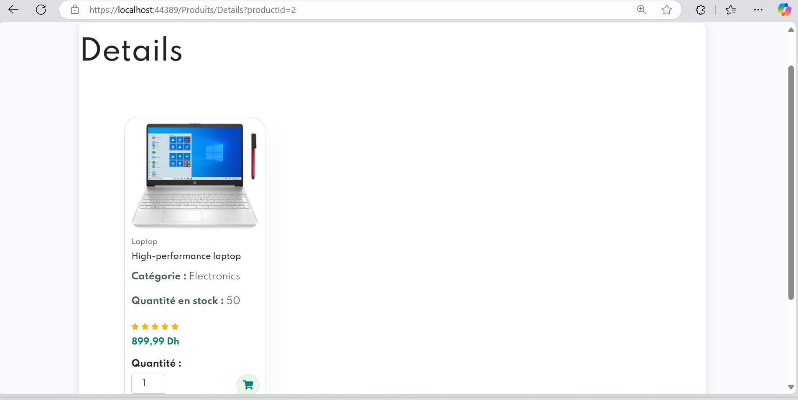

# Ecommerce MVVM

This is a simple e-commerce application built using the **MVVM (Model-View-ViewModel)** pattern. The project focuses on implementing product categories, displaying products within categories, and managing a shopping cart.

## Features

- **Categories and Products**:  
  Users can browse different categories, and each category contains a list of products.

  

- **Product Details**:  
  Users can view detailed information about each product.

  

- **Shopping Cart Management**:  
  Users can add products to the shopping cart, update quantities, and remove items.

  

## MVVM Architecture

The project follows the MVVM architecture to ensure a clean separation of concerns and maintainable code.


## Technologies Used

- **C#** for backend logic.
- **WPF** (Windows Presentation Foundation) for UI.
- **MVVM** for architecture.
- **Entity Framework Core** for database interaction.

## Packages Used

- **Microsoft.EntityFrameworkCore.Design (5.0.17)**  
  Provides design-time services for creating models and migrations.

- **Microsoft.EntityFrameworkCore.SqlServer (5.0.17)**  
  SQL Server provider for Entity Framework Core.

- **Microsoft.EntityFrameworkCore.Tools (5.0.17)**  
  Command-line tools for managing migrations and database operations.

- **Microsoft.VisualStudio.Web.CodeGeneration.Design (5.0.2)**  
  Code generation tools for scaffolding components in the project.

## How to Run the Project

1. Clone the repository:
   ```bash
   git clone https://github.com/Ouissal0/Ecommerce_MVVM.git
